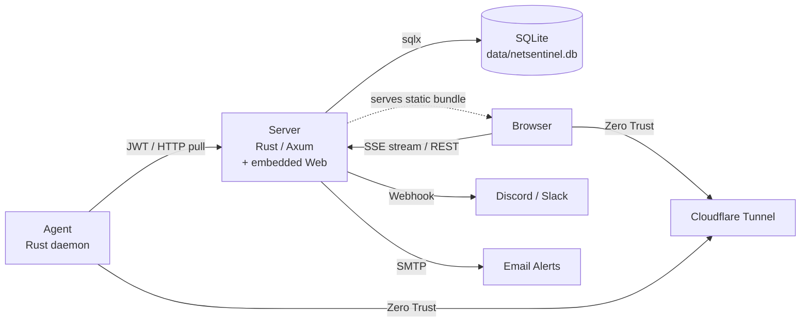

# NetSentinel

> NetSentinel is a monitoring tool for homelabs. It uses one container and one SQLite file. It gives real host metrics. You do not have to connect Prometheus, Grafana, Alertmanager, and Uptime Kuma.


---

## Project Status

NetSentinel is a new self-hosted project. It monitors homelabs and small servers.

The current objectives are:

- Easy installation.
- Reliable local storage.
- Clear contracts between the hub, the agent, and the dashboard.

The project changes quickly. But the default installation is simple and stable:

- The hub runs in Docker Compose.
- The agents run as native systemd (Linux) or launchd (macOS) services.
- SQLite keeps all state.

---

## Quick Start

### Install the hub

Do this procedure on the machine that will run the dashboard and the API.

1. Make sure that these tools are installed: Docker, Compose v2, `git`, `curl`, and `openssl`.
2. Run this command:

   ```bash
   curl -fsSL https://raw.githubusercontent.com/sounmu/netsentinel/main/scripts/install-hub.sh | bash
   ```

The script does these steps:

1. It clones the repository into `~/netsentinel`.
2. It makes a `.env` file with random secrets.
3. It pulls the `ghcr.io/sounmu/netsentinel-server` image.
4. It starts the hub.
5. It runs a smoke test with 5 checks.
6. It shows the URL of the web UI.

> **NOTE:** The script is tested on Linux and macOS. On Windows, run the script in WSL2.

### Install the host monitor on each monitored host

1. In the dashboard, go to **Hosts → Add Host**.
2. Select the network type: **LAN** or WireGuard (**Tailscale**).
3. Copy the install command. The command contains a short-lived enrollment token.
4. Run the command on the target host. The command is similar to this example:

   ```bash
   curl -fsSL https://raw.githubusercontent.com/sounmu/netsentinel/main/scripts/install-host.sh \
     | sudo bash -s -- \
         --server-url "http://<hub-ip>:3000" \
         --enroll-token "nsenr_..." \
         --network lan \
         --port 9101
   ```

If you select WireGuard (**Tailscale**) (or use `--network tailscale`), the host monitor binds to the WireGuard (Tailscale) IPv4 address of the host.

The installer does these steps:

1. It downloads the correct prebuilt binary from GitHub Releases.
2. It verifies the binary with `SHA256SUMS`.
3. It claims the enrollment token.
4. It writes an auth secret for this host.
5. It installs a systemd unit (Linux) or a launchd daemon (macOS).
6. It starts the service.
7. It registers the host in the hub.

To pin or update the host monitor, run the installer again with `--ref <release-tag>`.

> **NOTE:** To install from an unreleased branch or a fork, add `--build-from-source --ref <branch-or-tag>`. This option requires `git` and the Rust toolchain.

### Register the host in the UI

1. Open `http://<hub-ip>:3000/setup`.
2. Make the first local admin account. Google OAuth is optional. You can enable it later.
3. Go to **Hosts → + Add Host**.
4. Select LAN or WireGuard (Tailscale).
5. Copy the install command to the target machine and run it.
6. Wait one scrape interval (default 10 s). The host status changes from `pending` to `online`.

For a full procedure and for troubleshooting, refer to [`docs/AFTER_INSTALL.md`](docs/AFTER_INSTALL.md).

### Update

The installers are idempotent. To update, run the installer again. The `update-*.sh` scripts do this for you. You do not have to remember image tags or auth secrets.

**Hub** (on the dashboard host):

```bash
# Update to the latest published image
bash ~/netsentinel/scripts/update-hub.sh

# Update to a specified release
bash ~/netsentinel/scripts/update-hub.sh --version v0.5.1

# Update only the Docker image. Do not change the local repository (for CI or cron)
bash ~/netsentinel/scripts/update-hub.sh --skip-git-pull
```

The script does these steps:

1. It runs `git pull --ff-only`.
2. It runs `docker compose pull server`.
3. It makes the container again.
4. It runs the smoke test.

The script does not change the SQLite data, the `.env` file, or a `docker-compose.override.yml` file. The `data/` directory is a bind mount. Thus the data stays when the container is made again.

**Host monitor** (on each monitored host):

```bash
# Update to the latest release
curl -fsSL https://raw.githubusercontent.com/sounmu/netsentinel/main/scripts/update-host.sh \
  | sudo bash

# Update to a specified tag
curl -fsSL https://raw.githubusercontent.com/sounmu/netsentinel/main/scripts/update-host.sh \
  | sudo bash -s -- --ref v0.5.1
```

The script does these steps:

1. It reads `AGENT_AUTH_SECRET`, `AGENT_PORT`, and `AGENT_BIND` from `/etc/netsentinel/agent.env`. If `AGENT_AUTH_SECRET` is not there, it reads the legacy alias `JWT_SECRET`.
2. It runs the installer again with these values.
3. It replaces the binary.
4. It restarts the systemd unit (Linux) or the launchd daemon (macOS).

To test an unreleased fix, add `--build-from-source --ref <branch>`.

### Remove

**Hub**

By default, the script keeps the SQLite database and the `.env` file. Thus, a new installation continues with the old data. To delete all data, use `--purge`.

```bash
# Stop the stack only
bash ~/netsentinel/scripts/remove-hub.sh

# Delete all data and the image
bash ~/netsentinel/scripts/remove-hub.sh --purge --remove-image -y
```

**Host monitor**

The script stops the service. Then it removes the binary, the configuration (`/etc/netsentinel/`), the unit file, and the log directory.

```bash
curl -fsSL https://raw.githubusercontent.com/sounmu/netsentinel/main/scripts/remove-host.sh \
  | sudo bash
```

The command `sudo install-host.sh --uninstall` does the same thing. You can use either command.

### Troubleshooting

Run the diagnostic script. It does the checks in sequence and shows the correct recovery command.

```bash
cd ~/netsentinel
./scripts/doctor.sh
```

### Manual install

If you do not want to pipe the installer into a shell, do these steps manually:

```bash
git clone https://github.com/sounmu/netsentinel.git
cd netsentinel
./scripts/bootstrap.sh            # makes the .env file
docker compose pull server
docker compose up -d server
./scripts/smoke-test.sh
```

---

## Why NetSentinel?

Most monitoring stacks are good for large fleets. But they are frequently too complex for a small homelab. A small homelab can have a NAS, a mini PC, a Raspberry Pi, a Docker host, and some services behind WireGuard (Tailscale) or Cloudflare Tunnel.

**NetSentinel** is for this small configuration:

- A self-hosted hub pulls metrics from native Rust agents.
- An embedded SQLite database keeps all data.
- The same container serves the dashboard.
- The hub sends alerts. You do not need a separate metrics database or dashboard stack.

Use NetSentinel if you want:

- One Docker Compose service for the hub. The API, dashboard, auth, alerts, and SQLite are in one container.
- A native Linux or macOS agent. It reports CPU, memory, load, disks, processes, network, Docker containers, temperatures, and optional GPU metrics.
- Pull-based monitoring over LAN, WireGuard (Tailscale), or Cloudflare Tunnel. JWT auth protects the connection between the hub and the agents.
- Simple backups. Copy `data/netsentinel.db`. You do not have to manage a database container.
- Built-in HTTP and TCP uptime checks.
- Alerts to Discord, Slack, or Email.
- A dashboard that operates immediately. You do not have to configure Grafana panels.

NetSentinel does not replace:

- Prometheus and Grafana for large fleets, high-cardinality metrics, PromQL, or long-term observability pipelines.
- Full incident-management systems with on-call rotations and escalation policies.
- Log aggregation tools, for example Loki, ELK, or OpenSearch.

## Highlights

- **One container and one file.** The hub keeps all state in `data/netsentinel.db` (SQLite WAL mode). This state includes metrics, users, host configuration, alert rules, monitor checks, and dashboard layout.
- **Agent ports do not have to be public.** The hub pulls data from agents over private networks or tunnels. A usual configuration is `host_key = <tailscale-ip>:9101`.
- **Efficient agent protocol.** Agents send gzipped `bincode` over HTTP. This keeps the scrape payloads small on tunnel links.
- **SQLite rollups, not TimescaleDB.** The hub keeps raw 10-second metrics for a short time. It keeps 5-minute rollups for a longer time. Long-range charts use the smaller rollup table.
- **Real-time dashboard.** SSE sends status and live metrics to the browser. The client collects updates into batches. This prevents too many renders.
- **Docker monitoring with little polling.** The agent uses Docker events for lifecycle state. On inspect, it records OOM, exit, restart, health, and Compose labels. It polls resource statistics separately. The dashboard shows a Docker page for each host and a page with all containers.
  - The inventory shows the raw Docker state and the operational class separately.
  - Unhealthy containers, OOM events, and non-zero exits need action.
  - Jobs with exit code 0 are complete.
  - Created and paused objects stay visible with the class "intent unknown".
  - You can search, filter by raw state or operational class, and group by Compose stack or service. Filters do not hide residual objects.
- **Native agents first.** A native installation gives the most accurate host data. Docker agents are possibly available later as an option for Linux homelabs.

---

## Architecture



In production, the hub is **one container**. Axum serves `/api/*` and the static Next.js dashboard. SQLite keeps the state in `/app/data/netsentinel.db`.

For local development, the parts are separate. The Rust server uses port 3000. The Next.js dev server uses port 3001.

**Frontend route contract:** The host detail page is the static route `/host/?key=<host_key>`. The bundle is exported as plain HTML with `trailingSlash: true`. Thus the canonical URL has a trailing slash. The `host_key` is a query parameter, not a dynamic path segment. The client reads it with `useSearchParams()`.

**Data flow:**

1. The server schedules each registered agent at the `scrape_interval_secs` of that host (default 10 s). It inserts the metrics in one transaction.
2. SQLite keeps the raw metrics for 3 days. A 5-minute rollup table keeps data for 90 days.
   - The in-process `rollup_worker` updates the rollup table every 60 seconds.
   - The daily `retention_worker` deletes old rows from each time-series table.
3. The browser loads the static bundle from the same origin as the API. Then it connects to the SSE stream for real-time updates.
   - The SSE stream uses memory only. It does not read the database. The client batches updates with rAF.
   - The SSE `metrics` event contains CPU, memory, load, network rate, cumulative network counters, disks, temperatures, and Docker statistics.
   - The SSE `status` event contains Docker lifecycle, Compose, and health snapshots.
   - The server stops long-lived streams when the session is revoked.
4. The REST API downsamples data automatically:
   - 6 h or less: raw data.
   - 6 h to 14 d: 5-minute rollup.
   - More than 14 d: 15-minute re-aggregation.
5. The server sends alerts to Discord, Slack, and Email channels.

---

## Monorepo Structure

```
netsentinel/
├── server/   # Rust/Axum backend: metrics API, scraper, alerts,
│             # and (in production) the embedded web static bundle
├── web/      # Next.js dashboard: compiled with `output: 'export'`
│             # and put into the server image at build time
└── agent/    # Rust agent daemon
```

---

## Run without Docker (development only)

Use this procedure only when you change the code. For a production homelab installation, use the Quick Start. It is faster and safer.

### Server (port 3000)

```bash
cd server
cp .env.example .env   # set JWT_SECRET; DATABASE_URL default is sqlite://./data/netsentinel.db
mkdir -p data          # SQLite requires the parent directory
cargo run
```

### Web dashboard (port 3001, HMR)

```bash
cd web
cp .env.example .env.local   # NEXT_PUBLIC_API_URL=http://localhost:3000
npm install
npm run dev
```

`npm run dev` starts the full Next.js dev server. Dynamic routes and fast refresh operate. The `output: 'export'` and Axum-embed layout apply only when you build the production image.

### Agent (port 9101)

```bash
cd agent
cp .env.example .env   # set AGENT_AUTH_SECRET for local or manual agent runs
cargo run
```

---

## Environment Variables

### Root `.env` (Docker Compose)

| Variable | Required | Default | Description |
|---|---|---|---|
| `JWT_SECRET` | **Yes** | — | Hub secret (32 bytes minimum). It authenticates scrapes of legacy agents. User sessions use a different key. The hub makes that key at the first start (refer to `USER_JWT_SECRET`). New agents that you add in the UI get a secret for that agent only. `bootstrap.sh` makes this value with `openssl rand -hex 32`. The server does not start if the value is empty, too short, or a known public example. |
| `GOOGLE_OAUTH_CLIENT_ID` | No | — | Optional Google OAuth web-client ID. |
| `GOOGLE_OAUTH_CLIENT_SECRET` | No | — | Optional Google OAuth web-client secret. Only the server uses it. |
| `GOOGLE_OAUTH_REDIRECT_URI` | No | — | The exact callback that you register in Google Cloud, for example `https://dashboard.example.com/api/auth/oauth/google/callback`. Required only when Google OAuth is enabled. |
| `OAUTH_ADMIN_EMAILS` | No | empty | Comma-separated list of Google emails for the Google bootstrap policy. Existing users must start Google linking from a local session that is authenticated. |
| `OAUTH_BOOTSTRAP_FIRST_LOGIN_AS_ADMIN` | No | `true` | If Google OAuth is enabled and the `users` table is empty, the first verified Google login becomes the initial admin. |
| `COOKIE_SECURE` | No | inferred | The `Secure` flag of the refresh cookie. If it is not set, the server uses `GOOGLE_OAUTH_REDIRECT_URI`: `https` sets the flag, `http` does not set it (for local or LAN tests). |
| `NETSENTINEL_VERSION` | No | `latest` | Docker image tag for `ghcr.io/sounmu/netsentinel-server`. For reproducible installations, use a release tag, for example `v0.4.2`. |
| `CLOUDFLARE_TUNNEL_TOKEN` | No | — | Cloudflare Tunnel token. The server reads it only when you enable the `tunnel` service with a compose override. Refer to [`docs/DEPLOYMENT.md`](docs/DEPLOYMENT.md). |
| `NEXT_PUBLIC_API_URL` | No | empty (same origin) | Build-time web setting for custom local images. The published image is for same-origin deployments. This is the recommended homelab configuration. For split-origin deployments, do one of these: build a custom image with a `docker-compose.override.yml` (refer to [`docs/DEPLOYMENT.md`](docs/DEPLOYMENT.md)), or put the dashboard and the API behind one reverse-proxy hostname. |

> **NOTE:** If you upgrade from v0.3.x, remove `POSTGRES_USER`, `POSTGRES_PASSWORD`, and `POSTGRES_DB` from `.env`. The server does not read them now. A new installation does not need a data migration. To move data from an existing Postgres deployment, refer to the v0.4.0 section of [`CHANGELOG.md`](./CHANGELOG.md).

For local web development, the Next dev server uses `http://localhost:3001` and the Rust API uses `http://localhost:3000`. Google OAuth is optional. To enable it:

1. Register `http://localhost:3000/api/auth/oauth/google/callback` in Google Cloud.
2. Set the same value in `GOOGLE_OAUTH_REDIRECT_URI`.

The backend sets the refresh cookie. Then it sends the browser back to the permitted `3001` frontend origin.

### Server

With Docker Compose, the server reads the **root `.env`** file (`env_file: .env` in `docker-compose.yml`). Only a local `cargo run` reads `server/.env`.

- For a Docker installation, add these keys to `.env`.
- For a local development installation, add these keys to `server/.env`.
- Do not add the keys to both files.

| Variable | Required | Default | Description |
|---|---|---|---|
| `DATABASE_URL` | **Docker: automatic** / **local: yes** | — | SQLite connection URL. `docker-compose.yml` sets `sqlite:///app/data/netsentinel.db`. For a local `cargo run`, set it manually (`sqlite://./data/netsentinel.db`). The parent directory must exist. The server makes the `.db` file and the `-wal` and `-shm` files at the first start. |
| `ALLOWED_ORIGINS` | No | `http://localhost:3001` | Comma-separated CORS origins. With one container, this setting usually controls only third-party embeds. Split-origin deployments must include the two hostnames. Refer to [`docs/DEPLOYMENT.md`](docs/DEPLOYMENT.md). Do not use a trailing slash or `*`. |
| `SERVER_HOST` | No | `0.0.0.0` | Bind address. |
| `SERVER_PORT` | No | `3000` | Bind port. |
| `SCRAPE_INTERVAL_SECS` | No | `10` | Fallback scrape interval. The server uses it only if a host row does not have a valid `scrape_interval_secs`. Usually, the server schedules each host separately. |
| `WORKSPACE_TIMEZONE` | No | `UTC` | IANA timezone name (for example `Asia/Seoul` or `America/Los_Angeles`). The server uses it **only** for calendar groups, for example the daily uptime breakdown. All stored and API timestamps are UTC. The dashboard shows times in the timezone of your browser. If the name is not valid, the server shows a warning and uses UTC. |
| `MAX_DB_CONNECTIONS` | No | `10` | sqlx connection pool size. SQLite permits only one writer at a time. Thus, values more than approximately 10 do not increase throughput. They only increase idle pool memory. |
| `SSE_BUFFER_SIZE` | No | `128` | SSE broadcast channel buffer. The minimum is 128. You can increase it, but you cannot decrease it. |
| `TRUSTED_PROXY_COUNT` | No | `0` | Number of reverse proxies for X-Forwarded-For. `0` means that the server uses the peer IP. |
| `TRUST_CF_CONNECTING_IP` | No | `false` | Set `true` to also use `CF-Connecting-IP` for the client IP. Enable it only if all requests come to the hub through Cloudflare. Other proxies can pass a value that the client supplies. |
| `USER_JWT_SECRET` | No | generated | Key that signs user sessions. By default, the hub makes a random key at the first start and keeps it in the database. To keep the key in the environment, set this value. It must be different from `JWT_SECRET`. |
| `METRICS_CACHE_MAX_ENTRIES` | No | `20` | Maximum number of entries in each in-memory query cache. The server does not cache raw ranges of 6 h or less. TTL is 120 s. |
| `METRICS_CACHE_MAX_BYTES` | No | `33554432` | Estimated byte limit for each metrics query cache (default 32 MiB). If the entry limit or the byte limit is exceeded, the server removes the oldest entries. |
| `SQLITE_MMAP_SIZE` | No | `67108864` | SQLite mmap size in bytes (default 64 MiB). |
| `SQLITE_CACHE_SIZE_KB` | No | `8192` | SQLite page cache size in KiB (default 8 MiB). The server applies it as a negative `cache_size`. |
| `SQLITE_TEMP_STORE` | No | `MEMORY` | SQLite temporary storage mode: `DEFAULT`, `FILE`, or `MEMORY`. |
| `COOKIE_SECURE` | No | `true` | Sets the `Secure` flag on the refresh cookie. Keep it enabled in production. Set `false` only for local development with plain HTTP. |
| `METRICS_TOKEN` | No | — | Bearer token for `/metrics` (Prometheus). If you set it, each scrape must send `Authorization: Bearer <token>`. |
| `ALLOW_UNAUTHENTICATED_METRICS` | No | `false` | Set `true` to keep `/metrics` open when `METRICS_TOKEN` is not set. |

> **NOTE: Time and timezones.** NetSentinel keeps and sends all timestamps in **UTC**. SQLite uses epoch integers. The API uses RFC 3339 `…Z`. NetSentinel does not use KST or the local timezone of the server. The dashboard shows times in **the timezone of your browser**. Chart presets, date inputs, and axes use one fixed range. The UTC offset of the browser shows next to the controls. Calendar and report groups (for example the daily uptime breakdown) use `WORKSPACE_TIMEZONE` (default `UTC`).

### Agent `agent/.env`

| Variable | Required | Default | Description |
|---|---|---|---|
| `AGENT_AUTH_SECRET` | **Yes** | — | Auth secret for this host. The Add Host enrollment writes it. Legacy and manual installations can use `JWT_SECRET` as an alias. |
| `JWT_SECRET` | Legacy | — | Alias for old pinned agent binaries. For new installations, use `AGENT_AUTH_SECRET`. |
| `AGENT_PORT` | No | `9101` | Port of the agent HTTP server. |
| `AGENT_BIND` | No | `0.0.0.0` | Bind address. To make the native agent available only on the WireGuard (Tailscale) interface, use a WireGuard (Tailscale) IP, for example `100.x.y.z`. |
| `DOCKER_METRICS_MODE` | No | `auto` | Docker collection mode. `auto`: the agent collects data when Docker is available, and stops without errors when Docker is not available. `enabled`: the agent shows Docker connection failures. `disabled`: the agent does not connect to Docker. |

---

## API Endpoints

All endpoints require `Authorization: Bearer <JWT>`, unless the table shows a different condition. Read endpoints use `UserGuard`. `UserGuard` does not accept agent JWTs. Mutation endpoints use `AdminGuard`. Only the admin role can use them.

| Method | Path | Description |
|---|---|---|
| `POST` | `/api/auth/login` | Local login with username and password **(no auth)** |
| `POST` | `/api/auth/setup` | Make the initial local admin **(no auth, first run only)** |
| `GET` | `/api/auth/oauth/google/start` | Start Google OAuth with state and PKCE. If the request has a valid user JWT, the state is for account linking **(no auth for sign-in)** |
| `GET` | `/api/auth/oauth/google/callback` | Google OAuth callback. The server rejects unlinked Google subjects, unless an authenticated local session made the state **(no auth)** |
| `GET` | `/api/auth/me` | Get the current user data |
| `GET` | `/api/auth/status` | Get the public auth entry points **(no auth)** |
| `PUT` | `/api/auth/password` | Change or set the local password of the current user |
| `GET` | `/api/health` | Health check. Verifies the database **(no auth)** |
| `GET` | `/api/dashboard` | Get the dashboard layout of the user |
| `PUT` | `/api/dashboard` | Save the dashboard layout of the user |
| `GET` | `/api/hosts` | List all hosts with online status |
| `GET` | `/api/hosts/{host_key}` | Get the configuration of one host |
| `POST` | `/api/hosts` | Register a new host |
| `PUT` | `/api/hosts/{host_key}` | Update the host configuration |
| `DELETE` | `/api/hosts/{host_key}` | Delete a host |
| `POST` | `/api/agent-enrollments` | Make a short-lived Add Host enrollment token **(admin)** |
| `POST` | `/api/agent-enrollments/claim` | The installer claims a token and gets an auth secret for the agent **(no user auth)** |
| `GET` | `/api/metrics/{host_key}` | Get the 50 most recent metric rows |
| `GET` | `/api/metrics/{host_key}?start=&end=` | Get metrics in a time range (ISO 8601) |
| `GET` | `/api/metrics/{host_key}/chart?start=&end=` | Get small chart rows for host detail graphs (1 h or less: raw; more than 1 h: 5-minute rollup; more than 14 d: 15-minute re-aggregation) |
| `POST` | `/api/metrics/batch` | Get metrics for a maximum of 50 hosts |
| `GET` | `/api/uptime/{host_key}?days=` | Get the daily uptime breakdown |
| `GET` | `/api/alert-configs` | Get the global alert defaults |
| `PUT` | `/api/alert-configs` | Update the global alert defaults |
| `GET` | `/api/alert-configs/{host_key}` | Get the alert overrides of a host |
| `PUT` | `/api/alert-configs/{host_key}` | Add or update the alert overrides of a host |
| `DELETE` | `/api/alert-configs/{host_key}` | Delete the alert overrides of a host |
| `GET` | `/api/notification-channels` | List notification channels |
| `POST` | `/api/notification-channels` | Make a notification channel |
| `PUT` | `/api/notification-channels/{id}` | Update a notification channel |
| `DELETE` | `/api/notification-channels/{id}` | Delete a notification channel |
| `POST` | `/api/notification-channels/{id}/test` | Send a test notification |
| `GET` | `/api/alert-history?host_key=&limit=` | Get the alert event log |
| `GET` | `/api/http-monitors` | List HTTP monitors |
| `POST` | `/api/http-monitors` | Make an HTTP monitor |
| `GET` | `/api/http-monitors/summaries` | Get HTTP monitor summaries |
| `PUT` | `/api/http-monitors/{id}` | Update an HTTP monitor |
| `DELETE` | `/api/http-monitors/{id}` | Delete an HTTP monitor |
| `GET` | `/api/http-monitors/{id}/results` | Get HTTP check results |
| `GET` | `/api/ping-monitors` | List Ping monitors |
| `POST` | `/api/ping-monitors` | Make a Ping monitor |
| `GET` | `/api/ping-monitors/summaries` | Get Ping monitor summaries |
| `PUT` | `/api/ping-monitors/{id}` | Update a Ping monitor |
| `DELETE` | `/api/ping-monitors/{id}` | Delete a Ping monitor |
| `GET` | `/api/ping-monitors/{id}/results` | Get Ping check results |
| `GET` | `/api/public/status` | Get public status page data **(no auth)** |
| `GET` | `/metrics` | Prometheus metrics export. **Auth is required by default.** Set `METRICS_TOKEN`, or set `ALLOW_UNAUTHENTICATED_METRICS=true` |
| `POST` | `/api/auth/logout` | Revoke all tokens of the current user |
| `POST` | `/api/auth/refresh` | Rotate the refresh cookie and make a new access JWT. The cookie is the credential. No auth header |
| `POST` | `/api/auth/sse-ticket` | Make a single-use ticket for SSE |
| `POST` | `/api/admin/users/{id}/revoke-sessions` | Admin: revoke the sessions of a user |
| `GET` | `/api/stream?key=<ticket>` | SSE stream (`metrics` and `status`) |

Frontend permalink contract:

- Host detail: `/host/?key=<host_key>`
- Example: `/host/?key=192.168.1.10:9101`

---

## Database Schema

All tables are in one SQLite file: `data/netsentinel.db`. The file uses WAL mode. Hot-path tables use STRICT and WITHOUT ROWID. The in-process `retention_worker` deletes old rows from time-series tables. There are no hypertables or continuous aggregates. For the design rationale, refer to [`docs/SQLITE_MIGRATION.md`](docs/SQLITE_MIGRATION.md).

| Table | Description |
|---|---|
| **`metrics`** | Raw scrape rows. Retention is 3 days. JSON text columns keep CPU, memory, load, network, disk, process, temperature, GPU, Docker, and port data. Nullable scalar columns `rx_bytes_per_sec` and `tx_bytes_per_sec` keep bandwidth for rollups. |
| **`metrics_5min`** | 5-minute rollup table (`STRICT, WITHOUT ROWID`, PK `(host_key, bucket)`). `services::rollup_worker` fills it from `metrics` every 60 seconds with an idempotent UPSERT. It contains cumulative network counters, average bandwidth for each bucket, and the last JSON snapshot in each bucket for Docker statistics and container state. Retention is 90 days. |
| **`hosts`** | Agent registry. It contains the scrape interval, thresholds, monitored ports and containers, the `agent_auth_secret` of each agent, and system data (OS, CPU, RAM, IP). `ports` and `containers` are JSON arrays in TEXT columns. |
| **`agent_enrollment_tokens`** | Short-lived, single-use Add Host tokens. The table keeps only a SHA-256 hash of the token, the expiry time, the creator, and data about the host that used it. The install command shows the plain token one time only. |
| **`alert_configs`** | Alert rules (`cpu`, `memory`, `disk`, `load`, `network`, `temperature`, `gpu`, `docker`). A `NULL host_key` is the global default. A host row overrides the default. An expression-based UNIQUE INDEX on `(coalesce(host_key, ''), metric_type, coalesce(sub_key, ''))` gives the same result as `UNIQUE NULLS NOT DISTINCT`. |
| **`notification_channels`** | Alert targets: Discord, Slack, Microsoft Teams, Telegram, generic webhook, and Email SMTP. The configuration is JSON text. |
| **`dashboard_layouts`** | Dashboard widget layout for each user (JSON text). |
| **`users`** | Local users with username and password. Optional Google OAuth link with the key `(oauth_provider, oauth_subject)`. It keeps verified email and profile fields, role, `password_changed_at`, and `tokens_revoked_at` for JWT revocation. |
| **`refresh_tokens`** | Refresh token families (`BLOB` hash and family_id, INTEGER epoch timestamps). It supports rotation and reuse detection. |
| **`alert_history`** | Log of all alert events with timestamps. Rows do not change. Retention is 90 days. |
| **`http_monitors`** | Monitors for external HTTP endpoints, with check intervals. |
| **`http_monitor_results`** | HTTP check results (status code, response time, errors). Retention is 90 days. |
| **`ping_monitors`** | Monitors for network host reachability (TCP connect). |
| **`ping_results`** | Ping check results. RTT is `REAL`. Success is INTEGER 0 or 1. Retention is 90 days. |

---

## Tech Stack

| Component | Technology |
|---|---|
| Backend | Rust, Axum 0.8, sqlx 0.8 (bundled SQLite), lettre (SMTP) |
| Frontend | Next.js 16.2.9, React 19, Recharts, SWR, sonner (toast) |
| Agent | Rust, tokio, sysinfo, bollard (Docker), nvml-wrapper (NVIDIA GPU) |
| Database | Embedded SQLite (WAL mode). One file in `data/` |
| Deployment | Docker Compose (one container), Cloudflare Tunnel |

---

## Contributing

For the development setup, the coding conventions, and the PR process, refer to [CONTRIBUTING.md](./CONTRIBUTING.md).

---

## License

[Apache License 2.0](./LICENSE) © 2026 sounmu
